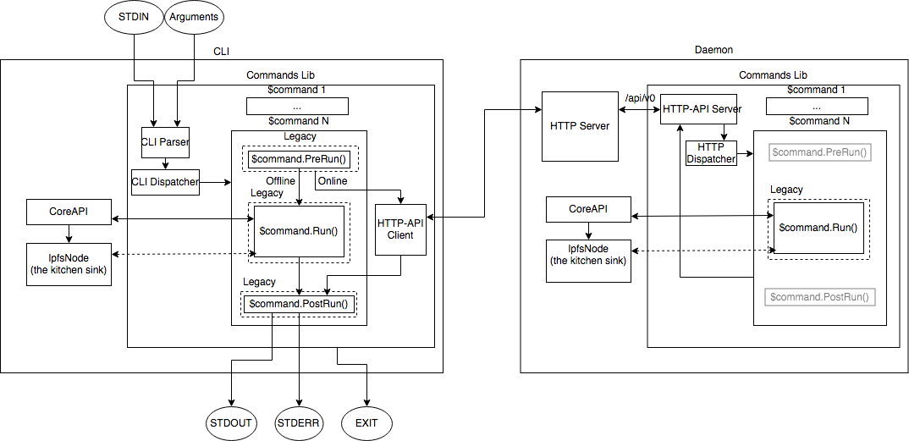

# go-ipfs


## What is IPFS?

IPFS is a global, versioned, peer-to-peer filesystem. It combines good ideas from previous systems such as Git, BitTorrent, Kademlia, SFS, and the Web. It is like a single BitTorrent swarm, exchanging git objects. IPFS provides an interface as simple as the HTTP web, but with permanence built-in. You can also mount the world at /ipfs.

For more info see: https://docs.ipfs.io/introduction/overview/


## Install

The canonical download instructions for IPFS are over at: https://docs.ipfs.io/guides/guides/install/. It is **highly recommended** you follow those instructions if you are not interested in working on IPFS development.

### System Requirements

IPFS can run on most Linux, macOS, and Windows systems. We recommend running it on a machine with at least 2 GB of RAM and 2 CPU cores (go-ipfs is highly parallel). On systems with less memory, it may not be completely stable.

If your system is resource-constrained, we recommend:

1. Installing OpenSSL and rebuilding go-ipfs manually with `make build GOTAGS=openssl`. See the [download and compile](#download-and-compile-ipfs) section for more information on compiling go-ipfs.
2. Initializing your daemon with `ipfs init --profile=lowpower`


### Build from Source

go-ipfs's build system requires Go 1.13 and some standard POSIX build tools:

* GNU make
* Git
* GCC (or some other go compatible C Compiler) (optional)

To build without GCC, build with `CGO_ENABLED=0` (e.g., `make build CGO_ENABLED=0`).

#### Install Go

The build process for ipfs requires Go 1.12 or higher. If you don't have it: [Download Go 1.12+](https://golang.org/dl/).

You'll need to add Go's bin directories to your `$PATH` environment variable e.g., by adding these lines to your `/etc/profile` (for a system-wide installation) or `$HOME/.profile`:

```
export PATH=$PATH:/usr/local/go/bin
export PATH=$PATH:$GOPATH/bin
```

(If you run into trouble, see the [Go install instructions](https://golang.org/doc/install)).

#### Download and Compile IPFS

```
$ git clone https://github.com/uranusbeam/bitwaves-ipfs.git

$ cd go-ipfs
$ make install
```

Alternatively, you can run `make build` to build the go-ipfs binary (storing it in `cmd/ipfs/ipfs`) without installing it.

**NOTE:** If you get an error along the lines of "fatal error: stdlib.h: No such file or directory", you're missing a C compiler. Either re-run `make` with `CGO_ENABLED=0` or install GCC.


##### OpenSSL

To build go-ipfs with OpenSSL support, append `GOTAGS=openssl` to your `make` invocation. Building with OpenSSL should significantly reduce the background CPU usage on nodes that frequently make or receive new connections.

Note: OpenSSL requires CGO support and, by default, CGO is disabled when cross-compiling. To cross-compile with OpenSSL support, you must:

1. Install a compiler toolchain for the target platform.
2. Set the `CGO_ENABLED=1` environment variable.


## Getting Started

See also: https://docs.ipfs.io/introduction/usage/

To start using IPFS, you must first initialize IPFS's config files on your
system, this is done with `ipfs init`. See `ipfs init --help` for information on
the optional arguments it takes. After initialization is complete, you can use
`ipfs mount`, `ipfs add` and any of the other commands to explore!

### Some things to try

Basic proof of 'ipfs working' locally:

    echo "hello world" > hello
    ipfs add hello
    # This should output a hash string that looks something like:
    # QmT78zSuBmuS4z925WZfrqQ1qHaJ56DQaTfyMUF7F8ff5o
    ipfs cat <that hash>

### Usage

```
  ipfs - Global p2p merkle-dag filesystem.

  ipfs [<flags>] <command> [<arg>] ...

SUBCOMMANDS
  BASIC COMMANDS
    init          Initialize ipfs local configuration
    add <path>    Add a file to ipfs
    cat <ref>     Show ipfs object data
    get <ref>     Download ipfs objects
    ls <ref>      List links from an object
    refs <ref>    List hashes of links from an object

  DATA STRUCTURE COMMANDS
    block         Interact with raw blocks in the datastore
    object        Interact with raw dag nodes
    files         Interact with objects as if they were a unix filesystem

  ADVANCED COMMANDS
    daemon        Start a long-running daemon process
    mount         Mount an ipfs read-only mount point
    resolve       Resolve any type of name
    name          Publish or resolve IPNS names
    dns           Resolve DNS links
    pin           Pin objects to local storage
    repo          Manipulate an IPFS repository

  NETWORK COMMANDS
    id            Show info about ipfs peers
    bootstrap     Add or remove bootstrap peers
    swarm         Manage connections to the p2p network
    dht           Query the DHT for values or peers
    ping          Measure the latency of a connection
    diag          Print diagnostics

  TOOL COMMANDS
    config        Manage configuration
    version       Show ipfs version information
    update        Download and apply go-ipfs updates
    commands      List all available commands

  Use 'ipfs <command> --help' to learn more about each command.

  ipfs uses a repository in the local file system. By default, the repo is located at
  ~/.ipfs. To change the repo location, set the $IPFS_PATH environment variable:

    export IPFS_PATH=/path/to/ipfsrepo
```

### Running IPFS inside Docker

An IPFS docker image is hosted at [hub.docker.com/r/ipfs/go-ipfs](https://hub.docker.com/r/ipfs/go-ipfs/).
To make files visible inside the container you need to mount a host directory
with the `-v` option to docker. Choose a directory that you want to use to
import/export files from IPFS. You should also choose a directory to store
IPFS files that will persist when you restart the container.

    export ipfs_staging=</absolute/path/to/somewhere/>
    export ipfs_data=</absolute/path/to/somewhere_else/>

Start a container running ipfs and expose ports 4001, 5001 and 8080:

    docker run -d --name ipfs_host -v $ipfs_staging:/export -v $ipfs_data:/data/ipfs -p 4001:4001 -p 127.0.0.1:8080:8080 -p 127.0.0.1:5001:5001 ipfs/go-ipfs:latest

Watch the ipfs log:

    docker logs -f ipfs_host

Wait for ipfs to start. ipfs is running when you see:

    Gateway (readonly) server
    listening on /ip4/0.0.0.0/tcp/8080

You can now stop watching the log.

Run ipfs commands:

    docker exec ipfs_host ipfs <args...>

For example: connect to peers

    docker exec ipfs_host ipfs swarm peers

Add files:

    cp -r <something> $ipfs_staging
    docker exec ipfs_host ipfs add -r /export/<something>

Stop the running container:

    docker stop ipfs_host

When starting a container running ipfs for the first time with an empty data directory, it will call `ipfs init` to initialize configuration files and generate a new keypair. At this time, you can choose which profile to apply using the `IPFS_PROFILE` environment variable:

    docker run -d --name ipfs_host -e IPFS_PROFILE=server -v $ipfs_staging:/export -v $ipfs_data:/data/ipfs -p 4001:4001 -p 127.0.0.1:8080:8080 -p 127.0.0.1:5001:5001 ipfs/go-ipfs:latest

It is possible to initialize the container with a swarm key file (`/data/ipfs/swarm.key`) using the variables `IPFS_SWARM_KEY` and `IPFS_SWARM_KEY_FILE`. The `IPFS_SWARM_KEY` creates `swarm.key` with the contents of the variable itself, whilst `IPFS_SWARM_KEY_FILE` copies the key from a path stored in the variable. The `IPFS_SWARM_KEY_FILE` **overwrites** the key generated by `IPFS_SWARM_KEY`.

    docker run -d --name ipfs_host -e IPFS_SWARM_KEY=<your swarm key> -v $ipfs_staging:/export -v $ipfs_data:/data/ipfs -p 4001:4001 -p 127.0.0.1:8080:8080 -p 127.0.0.1:5001:5001 ipfs/go-ipfs:latest

The swarm key initialization can also be done using docker secrets **(requires docker swarm or docker-compose)**:

    cat your_swarm.key | docker secret create swarm_key_secret -
    docker run -d --name ipfs_host --secret swarm_key_secret -e IPFS_SWARM_KEY_FILE=/run/secrets/swarm_key_secret -v $ipfs_staging:/export -v $ipfs_data:/data/ipfs -p 4001:4001 -p 127.0.0.1:8080:8080 -p 127.0.0.1:5001:5001 ipfs/go-ipfs:latest


## Development

Some places to get you started on the codebase:

- Main file: [./cmd/ipfs/main.go](https://github.com/uranusbeam/bitwaves-ipfs/blob/master/cmd/ipfs/main.go)
- CLI Commands: [./core/commands/](https://github.com/uranusbeam/bitwaves-ipfs/tree/master/core/commands)
- Bitswap (the data trading engine): [go-bitswap](https://github.com/ipfs/go-bitswap)
- libp2p
  - libp2p: https://github.com/libp2p/go-libp2p
  - DHT: https://github.com/libp2p/go-libp2p-kad-dht
  - PubSub: https://github.com/libp2p/go-libp2p-pubsub
- [IPFS : The `Add` command demystified](https://github.com/uranusbeam/bitwaves-ipfs/tree/master/docs/add-code-flow.md)

### Map of go-ipfs Subsystems
**WIP**: This is a high-level architecture diagram of the various sub-systems of go-ipfs. To be updated with how they interact. Anyone who has suggestions is welcome to comment [here](https://docs.google.com/drawings/d/1OVpBT2q-NtSJqlPX3buvjYhOnWfdzb85YEsM_njesME/edit) on how we can improve this!


### CLI, HTTP-API, Architecture Diagram



> [Origin](https://github.com/ipfs/pm/pull/678#discussion_r210410924)

Description: Dotted means "likely going away". The "Legacy" parts are thin wrappers around some commands to translate between the new system and the old system. The grayed-out parts on the "daemon" diagram are there to show that the code is all the same, it's just that we turn some pieces on and some pieces off depending on whether we're running on the client or the server.

### Testing

```
make test
```


## License

The go-ipfs project is dual-licensed under Apache 2.0 and MIT terms:

- Apache License, Version 2.0, ([LICENSE-APACHE](https://github.com/uranusbeam/bitwaves-ipfs/blob/master/LICENSE-APACHE) or http://www.apache.org/licenses/LICENSE-2.0)
- MIT license ([LICENSE-MIT](https://github.com/uranusbeam/bitwaves-ipfs/blob/master/LICENSE-MIT) or http://opensource.org/licenses/MIT)
